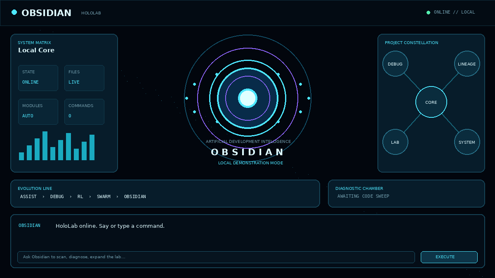

# OBSIDIAN // HoloLab

Obsidian is a local-first developer intelligence laboratory with a cinematic, screen-based holographic interface. It unifies the repository's assistant, debugging, reinforcement-learning, dashboard, and swarm experiments into one honest next-stage architecture.



## What works now

- Animated spatial HoloLab interface
- Full speech-reactive Obsidian humanoid avatar with holographic facial planes, neural constellations, scanning reconstruction, and project constellation
- Text commands and quick actions
- Browser speech recognition when supported
- Browser speech synthesis
- Local repository inventory
- Read-only Python syntax and structure diagnostics
- Structured panel-focus and visualization actions
- Responsive desktop and mobile layout
- Offline deterministic demo mode with no AI API key
- Automated core and API tests

## Run Obsidian

```bash
python -m venv .venv
source .venv/bin/activate       # Windows: .venv\Scripts\activate
pip install -r requirements.txt
python run_obsidian.py
```

Open `http://127.0.0.1:5000`.

Try:

- `status`
- `scan project`
- `diagnose code`
- `open hololab`
- `show lineage`
- `who are you`

## What “holographic” means

Stage One is a spatial holographic user interface rendered on a conventional screen. It uses depth, orbiting geometry, layered transparency, particles, glow, animated scanning, voice input, and voice output to create the HoloLab experience.

A physically floating or volumetric display is a hardware problem layered on top of this software. Obsidian can later target WebXR, transparent displays, Pepper's Ghost projection, depth cameras, or tracked multi-monitor installations without requiring that equipment today.

## Evolution—not erasure

The earlier code remains in the repository as the research progression that led here. It includes assistant scripts, specialized debuggers, reinforcement-learning prototypes, Flask interfaces, nano assistants, and swarm laboratory experiments.

See [From Developer Assistant to Obsidian](docs/EVOLUTION.md) for the capability map and honest limitations of the earlier stages.

## Architecture

Obsidian separates the visual shell from the assistant core:

```text
HoloLab UI + voice
        │
     Flask API
        │
 Obsidian local core
        │
 inventory + safe diagnostics
```

Read the full [architecture](docs/ARCHITECTURE.md) and [safety boundary](docs/SAFETY.md).

## Current limitations

- This is not a volumetric projector.
- The local demo core is deterministic, not a general language model.
- Voice recognition availability varies by browser.
- Diagnostics currently parse Python and inventory other file types.
- Earlier RL code is preserved as experimental lineage; completed DDPG learning is not claimed.
- Obsidian cannot edit files or execute arbitrary shell commands in Stage One.

## Roadmap

1. Model-provider interface and conversational planning
2. Permissioned developer tools and diff previews
3. Persistent project memory
4. Live architecture and dependency visualization
5. WebXR and gesture interaction
6. Optional physical projection and spatial hardware

## License

The repository retains its existing license. Third-party model or hardware integrations may introduce additional terms.
